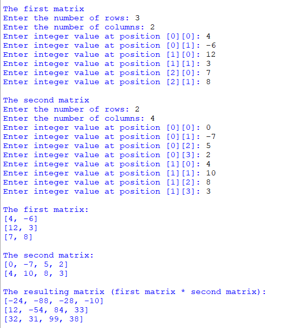

## Description
This program that enables users to input two matrices and performs matrix multiplication if they are compatible. It prompts users for matrix dimensions and values, then multiplies the matrices following mathematical rules. The program checks for dimension compatibility and displays the resulting matrix if multiplication is feasible.
## Example

